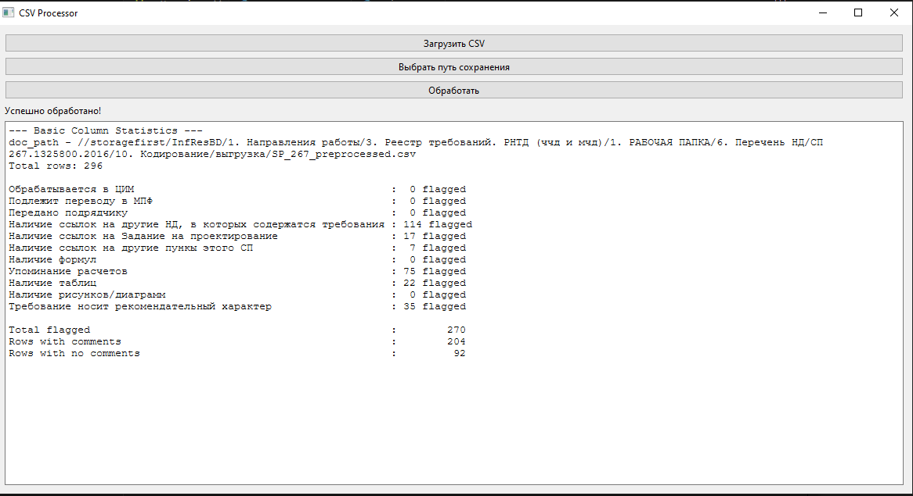

## Первый этап - очистка и фильтрация/классификаци данных 

- Может быть реализовано в виде поиска регулярных выражений, которые создают неоднозначность
- В последствии может быть реализовано через ML классификацию/кластреризацию

Реализация на регулярных выражениях:
[https://github.com/flairmix/fcc_01_analisys](https://github.com/flairmix/fcc_01_analisys)

