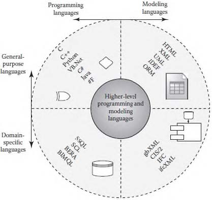

# Заголовок документа

Краткое описание документа или вступление.

- [Заголовок документа](#заголовок-документа)
  - [Глава 1. Введение](#глава-1-введение)
  - [Глава 2. Основная часть](#глава-2-основная-часть)
    - [“Dissertation on the Art of Combinations” Лейбниц.](#dissertation-on-the-art-of-combinations-лейбниц)
    - [Раздел 4.1.1 Метод «прямого» кодирования](#раздел-411-метод-прямого-кодирования)
    - [Раздел 4.1.2.1 Применение специализированных языков программирования](#раздел-4121-применение-специализированных-языков-программирования)
    - [Раздел 4.1.2.2 Building environment rule and analysis (BERA)](#раздел-4122-building-environment-rule-and-analysis-bera)
    - [Раздел 4.1.3 Логика первого порядка ( First order Logic )](#раздел-413-логика-первого-порядка--first-order-logic-)
    - [Раздел 4.1.3 Применение расширяемого языка разметки XML](#раздел-413-применение-расширяемого-языка-разметки-xml)
      - [4.1.4.2 Legal XML](#4142-legal-xml)
      - [4.1.4.3 Semantic mark-up RASE methodology](#4143-semantic-mark-up-rase-methodology)
  - [Глава 3. Заключение](#глава-3-заключение)
  - [Приложение](#приложение)


## Глава 1. Введение

Здесь размещается вводная информация, описание цели документа, задачи и важные замечания.

## Глава 2. Основная часть


<div type=useful> нотация BPMN 2.0 - для описания схем процессов </div>

### “Dissertation on the Art of Combinations” Лейбниц.
    - Тема 
    - Содержание 
    - Выводы 


### Раздел 4.1.1 Метод «прямого» кодирования

<p> Метод «прямого» кодирования является одним из самых простых для понимания, но
и в то же время одним из самых сложных c точки зрения его практической реализации.</p>
<p> Суть данной технологии заключается в разработке специализированного
программного решения, позволяющего осуществлять автоматизированные проверки
пользовательских данных на основании формулировок конкретных требований НТД.
Фактически, данный метод ничем не отличается от стандартной разработки программного
обеспечения.</p>

    <div type=usage> Solibri Model Checker (SMC) </div>
    <div type=usage> UpCodes AI.</div>


<div type=idea_mid><b> --- IDEA - Библиотека для кодирования требований python ---</b></div>    

### Раздел 4.1.2.1 Применение специализированных языков программирования

<p> Альтернативным методу «прямого» кодирования является технология применения
специализированных языков программирования (domain – specific languages),
ориентированных на предметную область строительства.</p>
<p> Отличие специализированных языков программирования (СЯП) от классических ЯП
заключается в учете особенностей предметной области.</p>



### Раздел 4.1.2.2 Building environment rule and analysis (BERA) 

[BERA Building Programming PDF](https://www.iaarc.org/publications/fulltext/isarc2014_submission_79.pdf)

### Раздел 4.1.3 Логика первого порядка ( First order Logic )

<p> Логика первого порядка (FOL) – это формальное исчисление, допускающее
высказывания относительно переменных, фиксированных функций и используемых
предикатов. Язык логики первого порядка основан на применении сигнатур (набора
символов, специфических для конкретной системы, сигнатура определяет формальный
язык системы). Сигнатуры состоят из множества функциональных символов, предикатных
символов, символов переменных, логических операций и кванторов. </p>

### Раздел 4.1.3 Применение расширяемого языка разметки XML


#### 4.1.4.2 Legal XML

<p>Одними из наиболее развитых подходов к формализации НТД с применением
расширяемого языка разметки на данный являются стандартов языков разметки Rule ML,
LegalDocument ML, LegalRule ML, Legal XML Electronic Court Filling TC, разрабатываемые
в рамках некоммерческого проекта Legal XML под эгидой консорциума OASIS16.
Проект Legal XML получил свое начало в 1998 г. и объединил несколько сотен
юристов, ученых, экспертов и специалистов в области компьютерных технологий.
Основная задача участников Legal XML заключается в развитии открытых стандартов для
представления юридических документов, судебных решений и прочих
специализированных документов в электронном виде, предназначенном для задач
машинной обработки.</p>

<p>§ 602 (b) In a case where the making of the copies of phonorecords would
have constituted an infringement of copyright if this title had been
applicable, their importation is prohibited.</p>

<p>В случае, если изготовление копий аудиозаписей является
нарушением авторских прав, их импорт запрещен.</p>

```xml 
<Implies id="rule602b">
  <then>
    <prohibition>
      <Atom id="rule602b-prh1-atm1">
        <Rel>importation is prohibited</Rel>
        <Var>z</Var>
      </Atom>
    </prohibition>
  </then>
  <if>
    <And>
      <Atom id="rule602-if-atm1">
        <Rel>copies or phonorecords</Rel>
        <Var>z</Var>
      </Atom>
      <Atom id="impl602-1-if-atm2">
        <Rel>without the authority of the owner of copyright</Rel>
        <Var>x</Var>
      </Atom>
    </And>
  </if>
</Implies>
```

#### 4.1.4.3 Semantic mark-up RASE methodology

RASE – Requirement, Applies, Select, Exception

<p>Технология RASE–разметки нормативных документов ориентирована на
преобразование положений нормативных документов в специализированный, полу-
структурированный формат представления данных, предназначенный для использования в
рамках задач, связанных с проверкой информационных моделей объектов строительства.
</p><br>

В языке разметки RASE18 используются четыре базовых элемента:
- requirement (требование);
- applies (применимость);
- select (выбор);
- exception (исключение).


## Глава 3. Заключение

1) Принцип разделения данных/формата и методов/исполняемого кода


## Приложение

Дополнительные материалы, ссылки, таблицы и другая полезная информация.

---

© Автор, год


